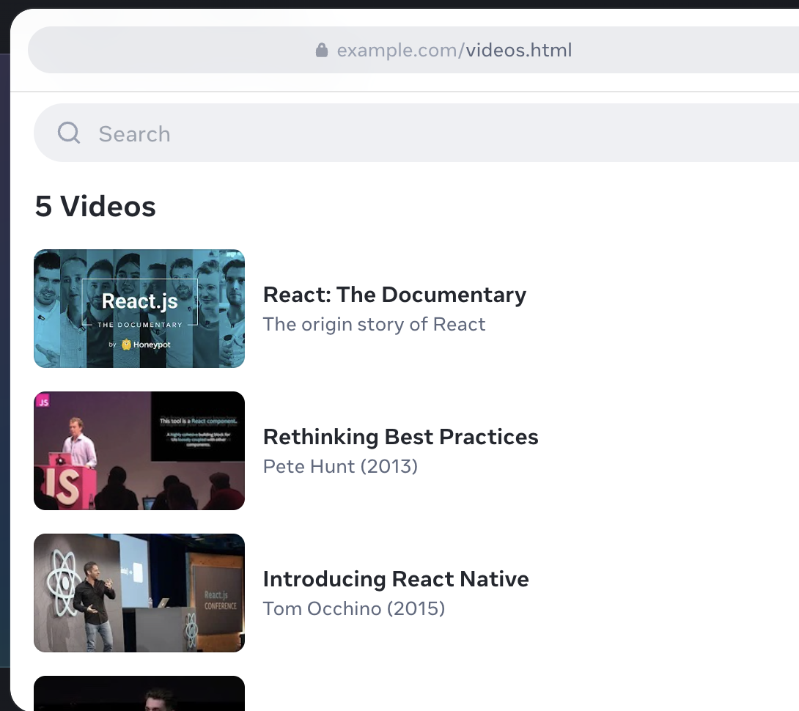

# Prompt

You are going to be making a very simple video app.

You will need to spin up the server we have provided you with in order to get the data to render said app.

The app needs to do the following:

- Render all of the videos provided by the API using the YoutubeVideo component provided, and have the title and subtitle present.
- Add a text input search bar that filters videos based on their header field
- Underneath the search bar, should present how many videos were found by the search results. I.E if 4 videos were found it would display 4 Videos.

# Important points

Please limit your work on this task to a maximum of two hours.

Please focus more on the functionallity than the styling. If you have time remaining feel free to style, but know it isn't a requirement.

Feel free to use whatever libraries you would like! That includes if you would like to use a library for search results.

Please use the provided Youtube component to render the videos.

# Getting Started with Create React App

This project was bootstrapped with [Create React App](https://github.com/facebook/create-react-app).

## Available Scripts

In the project directory, you can run:

### `npm start`

Runs the app in the development mode.\
Open [http://localhost:3000](http://localhost:3000) to view it in your browser.

The page will reload when you make changes.\
You may also see any lint errors in the console.

### `npm test`

Launches the test runner in the interactive watch mode.\
See the section about [running tests](https://facebook.github.io/create-react-app/docs/running-tests) for more information.

### `npm run build`

Builds the app for production to the `build` folder.\
It correctly bundles React in production mode and optimizes the build for the best performance.

The build is minified and the filenames include the hashes.\
Your app is ready to be deployed!

See the section about [deployment](https://facebook.github.io/create-react-app/docs/deployment) for more information.
